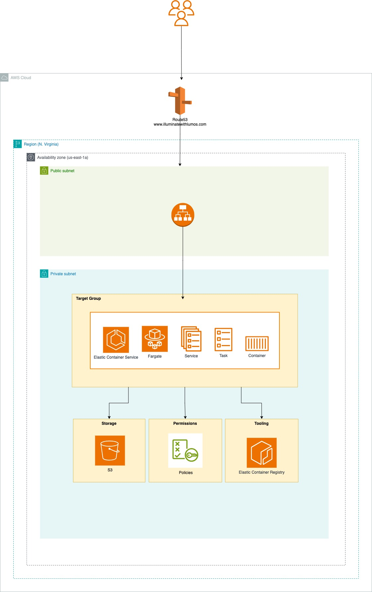

```text

       ,gggg,                                                  
      d8" "8I                                                  
      88  ,dP                                                  
   8888888P"                                                   
      88                                                       
      88       gg      gg  ,ggg,,ggg,,ggg,    ,ggggg,   ,g,    
 ,aa,_88       I8      8I ,8" "8P" "8P" "8,  dP"  "Y8gg,8'8,   
dP" "88P       I8,    ,8I I8   8I   8I   8I i8'    ,8I,8'  Yb  
Yb,_,d88b,,_  ,d8b,  ,d8b,dP   8I   8I   Yb,d8,   ,d8,8'_   8) 
 "Y8P"  "Y88888P'"Y88P"`Y8P'   8I   8I   `YP"Y8888P" P' "YY8P8P
                                                              
```

<p align="center">


</p>

## 📍Table of Contents
* 👋 [Overview](#overview)
* ✅ [Dependencies](#dependencies)
* 🌵 [File Structure](#file-structure)
* 💾 [Data](#data)
* 🏃 [Preliminary Steps](#preliminary-steps)
  * [AWS](#aws)
  * [Docker](#docker)
  * [Shiny](#shiny)
* 🚀 [Getting Started](#getting-started)
  * [CDK](#cdk)
  * [Shiny](#shiny-1)
* 🛠 [Deployment](#deployment)
* 🔑 [Best Practices](#best-practices)
* 📑 [Resources](#resources)

## 👋 Overview
In the enchanted realm of data science, complex data often lurks in the shadows like the basilisk in the Chamber of Secrets. The ability to quickly and efficiently deploy interactive data applications is akin to casting the perfect Lumos spell. With that spell alone data scientists are able to show hidden insights that allow for stakeholders to make actionable business decisions. Through this talk “Illuminate Your Data: Shiny + AWS CDK Deployments”, data scientists will see how powerful it is to use AWS CDK to deploy both R and Shiny applications within their own AWS infrastructure.

During this magical journey data scientist will witness the following:

* Introduction of AWS Cloud Development Kit (CDK) and its benefits over traditional cloud infrastructure provision methods.
* Best practices for organizing a CDK project and managing its dependencies.
* Detailed walkthrough on provisioning EC2 instances, S3 buckets and IAM roles.
* Demonstrating handling rollback and updates to the Shiny application using AWS CDK.

Automation and efficiency are at the core of this approach, allowing data scientists to automate repetitive deployment tasks and focus more on analysis rather than infrastructure management. With AWS CDK, applications can easily be built and deployed without manual intervention, ensuring reproducibility and consistency across different stages of development, testing, and production. Furthermore, AWS CDK helps optimize resource allocation and monitor usage to control costs effectively.
By the end of this walkthrough, you will have a comprehensive understanding of how to harness the power of AWS CDK to deploy Shiny applications, transforming how data insights are shared and utilized. Join us to illuminate your data and elevate your data science workflows to the cloud.

Slides for this code are located [here](Illuminate%20Your%20Data%20-%20Shiny%20+%20CDK%20Deployments.pdf)
<p align="center">
  
</p>


[](https://www.linkedin.com/in/zuri-hunter-748ba514)
[](https://x.com/ZuriHunter)
[](https://github.com/thestrugglingblack)

## ✅ Dependencies
* AWS Account
* Docker 
* Python (v3.8)
* Node.js (v22)
* NVM

## 🌵 File Structure
```text
.
├── Dockerfile
├── cdk
│   ├── README.md
│   ├── app.py
│   ├── lumos
│   │   ├── auth
│   │   ├── compute
│   │   ├── network
│   │   ├── storage
│   │   └── utils
└── shiny
```


## 💾 Data
The Lumos application uses data from these two free Kaggle Datasets: [Harry Potter Movies Dataset](https://www.kaggle.com/datasets/maricinnamon/harry-potter-movies-dataset) and [Harry Potter Dataset Spells](https://www.kaggle.com/datasets/electroclashh/harry-potter-dataset?resource=download&select=Spells.csv)
The data consist of the entire script, characters, places and spells for all of 8 movies of the Harry Potter series. 

##  🏃 Preliminary Steps

### AWS
#### Install AWS-CDK Globally
> Note: Node.js and NVM must be installed to run this step.

1. Run `nvm use` to point to Node v22.
2. Run `npm install -g aws-cdk` to install AWS-CDK globally.
3. Run `cdk --version` to verify that AWS-CDK installed successfully.

#### Configure AWS Account Permissions
1. Create user
2. Add permissions
3. Copy keys

#### Create .env file
1. Create a file called `.env` at the root of the directory.
2. Copy the contents of `.env.template` into the newly created `.env` file.
3. Add your `AWS_ACCOUNT_ID` to the `.env.` This is needed for aws-cdk to know which AWS account to deploy resources to.


### Docker
### Shiny

## 🚀 Getting Started
### CDK

### Docker
To run the application via Docker.

### Shiny
To run the application on local machine


To run the application with Docker

## 🛠 Deployment
### AWS Stack Deployment
There are series of steps for deploying this application. The first step is establishing the base resources before placing the application in its environment.

1. Deploy the that is going to hold all version of the Lumos application Docker images: Elastic Container Registry (ECR). 
```bash
$ cdk deploy EcrStack
```
> Note 📄: This is a command that will only need to ran once.

2. Deploy the storage layer, this is where the Lumos application will know where to download the `*.csv` files to run analysis.
```bash
$ cdk deploy S3Stack
```

3. Deploy the network layer, where the VPC, Security groups and Application Load Balancers are created.

```bash
$ cdk deploy SecurityGroupStack
$ cdk deploy LoadBalancerStack
````

4. Finally deploy the compute layer which is placing a Fargate EC2 instance within an Elastic Container Service cluster (ECS).
```bash
$ cdk deploy FargateServiceStack
```

To destroy any of the stacks created run `cdk destroy NAME_OF_STACK`, this will remove the stack from the Lumos application architecture on AWS. 
### Manual ECR/Docker Image Update

ECR AWS login
1. Verify that you have `AmazonEC2ContainerRegistryFullAccess` as a permission for you account. Thats here ` https://console.aws.amazon.com/iam/.`
2. Run to login to ECR
```
 aws ecr get-login-password --region REGION | docker login --username AWS --password-stdin ACCOUNT_ID.dkr.ecr.REGION.amazonaws.com

```
3. Tag the image
```json
 docker tag  wisd24/lumos-shiny-application:latest ACCOUNT_ID.dkr.ecr.REGION.amazonaws.com/wisd24/lumos-shiny-application:latest
```
4. Push the image
```json
docker push ACCOUNT_ID.dkr.ecr.REGION.amazonaws.com/wisd24/lumos-shiny-application:latest
```

## 🔑 Best Practices
### CDK
1. **Principle of Least Privilege** - Always exercise applying the minimum role and permission to AWS resources. This means not utilizing default policies and applying `*` to defining what resources that policy is associated with it. For example
If you have an EC2 instance that only needs to read contents of a file in a S3 bucket then define your policy like the following:
```python
# # # DO!
   policy_statement = iam.PolicyStatement(
            actions=[
                "s3:ListBucket",
                "s3:GetObject"
            ],
            resources=[
                "arn:aws:s3:::wisd-data-lumos",
                "arn:aws:s3:::wisd-data-lumo/csv/*"
            ],
            effect=iam.Effect.ALLOW
        )
```
And not like this example below where its allowing for all actions for all S3 buckets.

```python
# # # DON'T!
   policy_statement = iam.PolicyStatement(
            actions=[
                "s3:*"
            ],
            resources=[
                "*"
            ],
            effect=iam.Effect.ALLOW
        )
```

2. **Seperation of Concerns** - Build your AWS stacks in a way where they are not too dependent on each other if there was a major change or adjustment to its configuration. An example would be separating the creation of a Log Group and Lambda function. If there is an update for the Lambda function and the creation of a Log Group is in the same stack it may pose a CDK Error of `Can't deploy because XYZ Log Group resource has already been created`.

3. **Console First, CDK Second** - Create the infrastructure of your resources through the AWS console first before writing the code to build the stacks. This will help give you an understanding what additional resources and configuration is needed to support your application. Trying to build it through CDK first will significantly delay productivity if you are not 100% sure on what configuration is needed for your application.

4. **Hide Your Secrets** - Leverage `AWS Parameter Store` and `AWS Secrets Manager` to store any sensitive information that is needed for you application infrastructure, this includes, access tokens, account IDs and passwords. This will prevent sensitive application data from being leaked in between deployments in the event there is malicious activity occurring.


## 📑 Resources
* [Color Hunt](https://colorhunt.co/palette/8cb9bdfefbf6ecb159b67352)
* [Communicate Between R and Shiny](https://unleash-shiny.rinterface.com/shiny-intro#:~:text=In%20practice%2C%20Shiny%20does%20not,can%20produce%20a%20simple%20histogram.)


